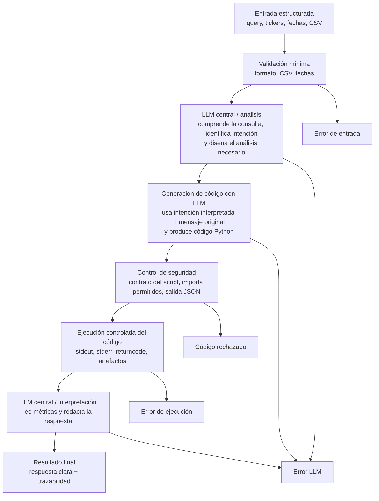

# Arquitectura Actual del TFM: LLM + Codegen Controlado

Este documento resume el estado actual del proyecto tras el cambio de arquitectura. Ahora el flujo se centra en un LLM que interpreta la consulta, genera código Python, pasa por una capa de seguridad, ejecuta el script y vuelve a usar el LLM para explicar los resultados.

> **Estado del documento:** esta arquitectura sigue siendo la que ejecuta el repositorio actualmente, pero se considera una iteración experimental. La arquitectura objetivo acordada para la siguiente evolución del MVP se describe en `docs/flujo_completo_proyecto_borrador.md`. Se conserva este documento para mantener trazabilidad técnica, explicar las evaluaciones ya realizadas y justificar por qué el codegen dinámico dejará de ser el camino principal.

## Mapa Conceptual



## Idea Principal

El objetivo del TFM es construir un sistema de análisis financiero histórico donde el LLM no actúa como un simple chatbot. El modelo participa en tres momentos:

1. Interpreta la intencionalidad de la consulta.
2. Genera código Python para calcular métricas.
3. Redacta una explicación final a partir de la salida ejecutada.

Entre la generación de código y la ejecución hay una capa de control de seguridad. Esto es importante porque el sistema no debe ejecutar cualquier código generado por el modelo sin revisar antes su estructura.

## Evolución del MVP

El proyecto se desarrolló de forma incremental. Primero se buscó validar un flujo mínimo con un LLM de OpenAI o compatible con OpenAI y dos intencionalidades: crecimiento de un activo y comparación entre activos. Después, al comprobar que el flujo funcionaba, el MVP se amplió a seis intencionalidades analíticas. La arquitectura actual corresponde a una etapa posterior: flujo LLM + codegen controlado, con seguridad, ejecución aislada, trazabilidad y preparación para comparar varios modelos.

La fase más reciente consiste en preparar una evaluación definitiva con queries más complejas sobre los mismos datos históricos, sin ampliar el dataset. Esa fase se documenta con más detalle en `docs/evolucion_mvp_tfm.md`, `docs/evaluacion_cualitativa_llm.md` y `docs/planificacion_evaluacion_tfm.md`.

## Entrada del Sistema

La entrada se representa con `FinancialQueryInput`, definida en `src/schemas.py`.

Campos principales:

- `query`: mensaje original del usuario.
- `tickers`: lista de activos financieros.
- `csv_paths`: rutas a los CSV históricos.
- `intent`: pista opcional, si existe.
- `start`: fecha inicial opcional.
- `end`: fecha final opcional.
- `period`: periodo relativo opcional.
- `interval`: intervalo de los datos.
- `warnings`: avisos heredados de fases previas.

La `intent` ya no se usa para enrutar a un agente. Ahora solo puede servir como pista inicial para el LLM.

## Flujo Paso a Paso

### 1. Validación Mínima

Archivo:

`src/graph/validation.py`

Comprueba:

- que la query no este vacía;
- que exista al menos un ticker;
- que exista al menos una ruta CSV;
- que las fechas `start` y `end`, si existen, tengan formato `YYYY-MM-DD`;
- que los CSV existan en disco.

Si algo falla, el workflow termina con `completed_with_error`.

### 2. Análisis LLM

Archivo:

`src/llm/pipeline.py`

Función:

`build_llm_analysis`

El LLM recibe la entrada estructurada y devuelve un `AnalysisPlan`.

El plan contiene:

- `interpreted_intent`: intencionalidad interpretada.
- `analysis_type`: tipo de análisis financiero.
- `metrics`: métricas que deben calcularse.
- `required_columns`: columnas necesarias.
- `data_requirements`: requisitos sobre los datos.
- `output_requirements`: qué debe devolver el script.
- `presentation_preferences`: cómo quiere el usuario recibir el resultado.
- `reasoning`: explicación breve de por que se ha elegido ese análisis.

### 3. Generación de Código

Archivo:

`src/llm/pipeline.py`

Función:

`build_llm_code`

El generador de código recibe dos fuentes de información:

- el plan interpretado por el LLM;
- el mensaje original del usuario.

Debe generar un script Python que:

- tenga una función `main()`;
- lea el payload desde `argv[1]`;
- calcule métricas a partir de los CSV;
- escriba un único JSON por `stdout`;
- no redacte la respuesta final al usuario.

### 4. Control de Seguridad

Archivo:

`src/execution/code_security.py`

Función:

`validate_generated_code`

Comprueba:

- que exista `main()`;
- que se use `json.dumps`;
- que los imports esten permitidos;
- que no se usen llamadas bloqueadas como `eval`, `exec`, `compile`, `open`, `input` o `__import__`;
- que no se usen módulos peligrosos como `os`, `subprocess`, `shutil`, `socket`, `requests`, `urllib` o `httpx`.

Imports permitidos actualmente:

- `__future__`
- `json`
- `sys`
- `pathlib`
- `math`
- `statistics`
- `pandas`
- `numpy`
- `src.execution.market_data`

Si el código no supera esta validación, el workflow termina como código rechazado.

### 5. Ejecución Controlada

Archivo:

`src/execution/code_runner.py`

Función:

`run_generated_code`

Hace lo siguiente:

- guarda el script generado en `results/code/`;
- guarda el payload en `results/logs/`;
- ejecuta el script en un proceso separado;
- captura `stdout`;
- captura `stderr`;
- captura `returncode`;
- intenta parsear `stdout` como JSON;
- guarda artefactos auditables.

Esto permite revisar qué código se generó, con qué entrada se ejecutó y qué salida produjo.

### 6. Interpretación Final con LLM

Archivo:

`src/llm/pipeline.py`

Función:

`build_llm_interpretation`

El LLM recibe:

- el resultado JSON del código ejecutado;
- el plan de análisis inicial.

Su tarea no es recalcular. Su tarea es explicar:

- que métricas se han obtenido;
- que significan;
- que conclusión descriptiva se puede sacar;
- sin hacer predicciones;
- sin recomendar comprar o vender;
- sin inventar datos externos.

## Nodos del Workflow

Archivo:

`src/graph/nodes.py`

Nodos actuales:

- `ingest_node`
- `llm_analysis_node`
- `code_generation_node`
- `code_security_node`
- `code_execution_node`
- `interpretation_node`
- `invalid_request_node`
- `execution_error_node`

Archivo:

`src/graph/build_graph.py`

Define el orden del workflow:

```text
ingest
-> llm_analysis
-> code_generation
-> code_security
-> code_execution
-> interpretation
```

Si `langgraph` esta instalado, se compila un grafo con transiciones condicionales. Si no, se usa `SimpleFinancialWorkflow`, que ejecuta la lista de nodos en secuencia.

## Prompts

Archivo:

`src/llm/prompts.py`

Prompts principales:

- `build_analysis_messages`: interpreta la consulta y construye el plan.
- `build_codegen_messages`: genera código Python.
- `build_interpretation_messages`: redacta la respuesta final.

El prompt de codegen exige explícitamente:

- devolver JSON válido con campo `code`;
- leer `argv[1]`;
- escribir JSON en `stdout`;
- no redactar respuesta final;
- usar solo imports permitidos.

## Configuración LLM

Archivo:

`src/config.py`

El proyecto asume LLM por defecto. Solo hay que configurar proveedor, clave y modelo.

Ejemplo Groq con `llama-3.3-70b-versatile` (Llama 3.3 70B Instruct, razonamiento general y generación de código con baja latencia):

```env
LLM_PROFILE=groq
GROQ_API_KEY=tu_clave_groq
GROQ_MODEL=llama-3.3-70b-versatile
```

Ejemplo Gemini con `gemini-2.5-flash` (modelo Flash de Gemini 2.5, rápido y orientado a razonamiento):

```env
LLM_PROFILE=gemini
GEMINI_API_KEY=tu_clave_gemini
GEMINI_MODEL=gemini-2.5-flash
```

Ejemplo `openai/gpt-oss-20b` sobre vLLM universitario (modelo abierto de la familia gpt-oss, usado por razonamiento, seguimiento de instrucciones y generación de código):

```env
LLM_PROFILE=university
UNIVERSITY_BASE_URL=https://w1.etsisi.upm.es/vllm/v1
UNIVERSITY_API_KEY=tu_clave_universidad
UNIVERSITY_MODEL=openai/gpt-oss-20b
```

Nota: `university` es el identificador técnico del perfil dentro del proyecto. En la memoria y en los resultados se hace referencia al modelo por su nombre: `openai/gpt-oss-20b`, servido mediante vLLM universitario, destacando su capacidad de razonamiento, seguimiento de instrucciones y generación de código. Groq se documenta como Groq con `llama-3.3-70b-versatile`, modelo Llama 3.3 70B Instruct para razonamiento general y baja latencia, y Gemini se documenta como Gemini con `gemini-2.5-flash`, modelo Flash orientado a rapidez y razonamiento.

## Cómo Ejecutar el MVP

Ejemplos:

```bash
python run_mvp.py --example growth_nvda
python run_mvp.py --example compare_nvda_amd
python run_mvp.py --example overview_aapl
python run_mvp.py --example returns_qqq_spy
python run_mvp.py --example risk_qqq_spy
python run_mvp.py --example technical_aapl
```

Con JSON propio:

```bash
python run_mvp.py --input-json path/a/input.json
```

## Cómo Ejecutar Tests

```bash
python -m unittest discover -s tests
```

Los tests no llaman a APIs reales. Simulan las respuestas LLM para comprobar:

- validación de entrada;
- construccion del flujo;
- validación de seguridad;
- ejecución controlada;
- interpretación final;
- errores esperados.

## Cómo Evaluar Proveedores LLM

Script:

`scripts/evaluate_llm_profiles.py`

Ejemplo:

```bash
python scripts/evaluate_llm_profiles.py --profiles groq gemini university --examples all
```

Con respuestas en consola:

```bash
python scripts/evaluate_llm_profiles.py --profiles groq gemini university --examples all --show-answers
```

Los resultados de depuración se documentaron inicialmente con `openai/gpt-oss-20b` sobre vLLM universitario, modelo abierto de la familia gpt-oss usado por su capacidad de razonamiento y generación de código. Después se comprobó que Groq con `llama-3.3-70b-versatile`, modelo Llama 3.3 70B Instruct, completa la batería compleja, y que Gemini con `gemini-2.5-flash`, modelo Flash de Gemini 2.5, completa consultas puntuales aunque puede verse limitado por cuota.

El script guarda resultados en:

`results/evaluations/`

## Cómo Revisar el Código Generado

Después de una ejecución real, revisar:

1. Script generado:

   `results/code/generated_*.py`

2. Payload usado:

   `results/logs/payload_*.json`

3. Salida estándar:

   `results/logs/stdout_*.json`

4. Errores:

   `results/logs/stderr_*.log`

Preguntas útiles para revisión:

- El LLM interpreto bien la intención del usuario?
- El plan estructurado contiene las métricas adecuadas?
- El código usa solo los CSV proporcionados?
- El código evita datos externos?
- La salida JSON es clara y trazable?
- La respuesta final explica los resultados sin inventar nada?
- Hay recomendaciones de inversión que deban eliminarse?

## Archivos Importantes Para Revisar

Código central:

- `src/schemas.py`
- `src/graph/build_graph.py`
- `src/graph/nodes.py`
- `src/graph/validation.py`
- `src/llm/prompts.py`
- `src/llm/pipeline.py`
- `src/llm/client.py`
- `src/execution/code_security.py`
- `src/execution/code_runner.py`
- `run_mvp.py`

Documentacion:

- `README.md`
- `docs/llm_api_setup.md`
- `docs/guia_credenciales_apis_llm_ordenador_personal.txt`
- `docs/memoria_latex/main.tex`
- `docs/memoria_latex/chapters/`
- `docs/memoria_latex/figures/arquitectura_nodos_workflow.tex`

Tests:

- `tests/test_mvp.py`
- `tests/test_llm_config.py`

## Estado Actual

Estado técnico verificado:

- Flujo LLM + codegen + seguridad implementado.
- Tests pasando.
- Memoria LaTeX actualizada con nueva arquitectura.
- Figura conceptual actualizada.

Comando de verificacion usado:

```bash
python -m unittest discover -s tests
```

Resultado esperado:

```text
Ran 17 tests
OK
```

## Punto Clave Para la Memoria

La frase resumen de la nueva arquitectura sería:

> El sistema transforma una consulta financiera estructurada en un análisis histórico mediante un flujo LLM con generación de código, validación de seguridad, ejecución controlada e interpretación final, manteniendo trazabilidad sobre datos, código y resultados.
