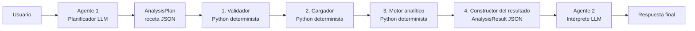
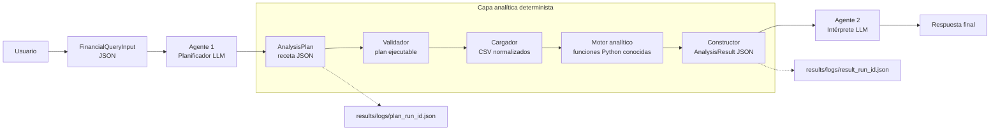

# Flujo completo del proyecto: arquitectura objetivo

## Objetivo del documento

Este documento describe la arquitectura que se propone adoptar como flujo principal del MVP. Su finalidad es servir como base de discusión, guía de implementación y referencia para redibujar la figura 5.1 de la memoria.

La decisión principal es separar claramente:

1. la comprensión de la consulta;
2. la ejecución de cálculos financieros;
3. la explicación de los resultados.

El sistema utilizará dos agentes LLM. Entre ambos agentes existirá una capa analítica determinista implementada en Python. Esta capa no llamará a ningún LLM adicional.

## Decisión de diseño

El agente 1 no generará código Python dinámico. Generará una receta analítica en JSON. Esa receta indicará qué datos y operaciones necesita el usuario.

Una capa Python programada y probada por nosotros validará la receta, cargará los CSV, ejecutará funciones financieras conocidas y construirá un resultado JSON homogéneo.

El agente 2 recibirá ese resultado estructurado y redactará una explicación para el usuario.



## Reparto de responsabilidades

| Componente | Responsabilidad | Usa LLM |
|---|---|---:|
| Agente 1 | Entender la consulta y generar la receta JSON | Sí |
| Validador | Comprobar que el plan sea ejecutable | No |
| Cargador | Leer y homogeneizar los CSV | No |
| Motor analítico | Calcular métricas con funciones Python conocidas | No |
| Constructor del resultado | Generar un JSON homogéneo para el agente 2 | No |
| Agente 2 | Explicar los resultados al usuario | Sí |

## Por qué se ha elegido esta arquitectura

La arquitectura busca un equilibrio entre sencillez, calidad técnica y valor académico.

JSON y Python no compiten entre sí. Cumplen funciones diferentes:

| Tecnología | Función |
|---|---|
| JSON | Comunicar de forma explícita qué debe calcularse y qué se ha obtenido |
| Python | Ejecutar cálculos financieros reproducibles |
| LLM | Comprender lenguaje natural y redactar explicaciones |

La decisión evita dos extremos:

- no dejamos que un LLM improvise cifras financieras;
- tampoco generamos un script Python nuevo para cada consulta habitual.

Las métricas frecuentes se calculan siempre mediante las mismas funciones. Esto mejora:

- reproducibilidad;
- seguridad;
- trazabilidad;
- mantenibilidad;
- pruebas automatizadas;
- comparación entre modelos;
- claridad de la figura de arquitectura.

## Qué recibe y qué genera cada fase

| Fase | Recibe | Genera | Persistencia propuesta |
|---|---|---|---|
| Entrada | Consulta, tickers, periodo y CSV | `FinancialQueryInput` | Opcionalmente `results/logs/input_<run_id>.json` |
| Agente 1 | `FinancialQueryInput` y catálogo de operaciones | `AnalysisPlan` JSON | `results/logs/plan_<run_id>.json` |
| Validador | `AnalysisPlan` y entrada normalizada | Plan validado o errores | `results/logs/validation_<run_id>.json` |
| Cargador | Rutas CSV, tickers y rango temporal | Tabla normalizada en memoria | Resumen en `AnalysisResult` |
| Motor analítico | Tabla normalizada y operaciones validadas | Métricas, tablas y series visuales | En memoria hasta construir el resultado |
| Constructor | Resultados parciales, procedencia y avisos | `AnalysisResult` JSON | `results/logs/result_<run_id>.json` |
| Agente 2 | Consulta, plan y `AnalysisResult` | Respuesta en lenguaje natural | `results/logs/answer_<run_id>.json` |

## Estado de implementación

Esta sección distingue el diseño acordado de lo que ya existe en el repositorio.

| Pieza | Estado | Código actual o ubicación propuesta |
|---|---|---|
| Entrada estructurada | Implementada | `src/schemas.py -> FinancialQueryInput` |
| Orquestación | Implementada, requiere adaptación | `src/graph/build_graph.py` y `src/graph/nodes.py` |
| Agente 1 | Implementado, requiere ajustar su contrato | `src/llm/pipeline.py -> build_llm_analysis` |
| Validación básica de entrada | Implementada | `src/graph/validation.py -> validate_input` |
| Validación de receta analítica | Pendiente | Propuesta: `src/graph/plan_validation.py` |
| Carga y normalización de CSV | Implementada | `src/execution/market_data.py` |
| Catálogo de operaciones | Pendiente | Propuesta: `src/execution/operation_registry.py` |
| Funciones financieras reutilizables | Parcialmente disponibles en scripts auxiliares | Propuesta: `src/execution/analytics.py` |
| Motor analítico | Pendiente | Propuesta: `src/execution/analysis_engine.py` |
| Constructor del resultado homogéneo | Pendiente | Propuesta: `src/execution/result_builder.py` |
| Agente 2 | Implementado, requiere recibir el nuevo contrato | `src/llm/pipeline.py -> build_llm_interpretation` |

El proyecto actual todavía contiene un flujo experimental que genera Python mediante LLM, valida su AST y ejecuta el script. Ese flujo ha servido para explorar flexibilidad y comparar modelos, pero se sustituirá como camino principal por el motor determinista descrito aquí.

## Contratos JSON principales

### Entrada: `FinancialQueryInput`

La entrada representa la consulta normalizada antes de llamar al agente 1.

El esquema ya existe en:

```text
src/schemas.py -> FinancialQueryInput
```

Ejemplo:

```json
{
  "query": "Comparame QQQ y SPY en 2024 de forma clara, con tabla y grafica normalizada",
  "tickers": ["QQQ", "SPY"],
  "csv_paths": [
    "data/raw/qqq_y_spy_desde_20240101_hasta_20241231.csv"
  ],
  "start": "2024-01-01",
  "end": "2024-12-31",
  "interval": "1d"
}
```

### Receta del agente 1: `AnalysisPlan`

La salida del agente 1 debe evolucionar hacia una receta ejecutable. No contiene cifras financieras. Contiene operaciones permitidas y requisitos de salida.

Ejemplo:

```json
{
  "analysis_type": "historical_comparison",
  "tickers": ["QQQ", "SPY"],
  "date_range": {
    "start": "2024-01-01",
    "end": "2024-12-31"
  },
  "interval": "1d",
  "operations": [
    {"name": "cumulative_return"},
    {"name": "annualized_volatility"},
    {"name": "max_drawdown"},
    {"name": "price_extremes"},
    {"name": "normalize_prices", "base": 100}
  ],
  "outputs": [
    {"type": "summary_table"},
    {"type": "line_chart", "source": "normalize_prices"}
  ],
  "response_style": {
    "level": "B",
    "audience": "non_technical"
  }
}
```

### Resultado para el agente 2: `AnalysisResult`

El resultado debe tener una forma homogénea para todas las consultas.

Ejemplo abreviado:

```json
{
  "contract_version": "1.0",
  "run_id": "20260602_example_qqq_spy",
  "status": "completed",
  "query_context": {},
  "results": {
    "metrics": {},
    "tables": [],
    "visualizations": []
  },
  "limitations": [],
  "data_provenance": {},
  "warnings": []
}
```

## Flujo completo

## Paso 0: orquestación

### Responsabilidad

El orquestador conecta los componentes y mantiene el estado de una ejecución. No calcula métricas y no toma decisiones financieras.

### Por qué se utiliza

Separar la orquestación de los cálculos permite:

- saber en qué fase falla una ejecución;
- registrar tiempos y errores por etapa;
- sustituir un componente sin reescribir todo el proyecto;
- representar el flujo claramente en la memoria.

### Código

El código actual se encuentra en:

```text
src/graph/build_graph.py
src/graph/nodes.py
src/schemas.py -> WorkflowState
```

`build_graph.py` utiliza LangGraph cuando está instalado y ofrece un fallback secuencial.

### Adaptación necesaria

El flujo actual:

```text
ingest
-> llm_analysis
-> code_generation
-> code_security
-> code_execution
-> interpretation
```

debe evolucionar hacia:

```text
ingest
-> llm_analysis
-> plan_validation
-> data_loading
-> analytics_execution
-> result_building
-> interpretation
```

## Paso 1: agente 1

### Pregunta a la que responde

> ¿Qué cálculos hay que realizar para contestar bien al usuario?

### Responsabilidad

El agente 1 entiende la consulta y genera una receta JSON. Decide:

- activos;
- rango temporal;
- frecuencia;
- operaciones;
- tablas;
- visualizaciones;
- profundidad de la respuesta.

### Qué recibe

- consulta original;
- entrada normalizada;
- catálogo de operaciones permitidas;
- reglas de calidad.

### Qué genera

Un `AnalysisPlan` JSON.

### Dónde vive su código

El comportamiento del agente 1 se configura actualmente en:

```text
src/llm/prompts.py -> build_analysis_messages
src/llm/pipeline.py -> build_llm_analysis
```

Su esquema se define en:

```text
src/schemas.py -> AnalysisPlan
```

### Qué debe persistirse

Propuesta:

```text
results/logs/plan_<run_id>.json
```

Guardar el plan permite auditar qué entendió el agente antes de ejecutar cálculos.

## Paso 2: validador del plan

### Responsabilidad

El validador comprueba que la receta del agente 1 puede ejecutarse. No interpreta la consulta y no calcula métricas.

### Por qué se utiliza

Un LLM puede producir JSON sintácticamente válido pero semánticamente incorrecto. Por ejemplo:

- solicitar una operación inexistente;
- pedir una columna no disponible;
- utilizar un parámetro inválido;
- solicitar una predicción futura;
- referirse a un ticker que no aparece en los CSV.

Validar el plan antes de calcular evita errores tardíos y resultados ambiguos.

### Qué recibe

```json
{
  "analysis_plan": {},
  "input": {}
}
```

### Qué comprueba

- que el JSON cumple el esquema;
- que los tickers solicitados existen;
- que los CSV indicados están disponibles;
- que las fechas son válidas;
- que cada operación está registrada;
- que los parámetros de cada operación son correctos;
- que los outputs solicitados pueden construirse;
- que no se solicitan predicciones ni recomendaciones.

### Qué genera

Si el plan es válido:

```json
{
  "status": "validated",
  "errors": [],
  "warnings": []
}
```

Si el plan contiene una operación no permitida:

```json
{
  "status": "rejected",
  "errors": [
    {
      "field": "operations[0].name",
      "code": "unsupported_operation",
      "message": "La operacion predict_future_price no pertenece al catalogo permitido"
    }
  ]
}
```

### Dónde vive su código

Ya existe validación básica de entrada en:

```text
src/graph/validation.py -> validate_input
```

La validación específica de la nueva receta debe añadirse en:

```text
src/graph/plan_validation.py -> validate_analysis_plan
```

### Dónde deja el resultado

El estado validado continúa en memoria. Para auditoría se propone:

```text
results/logs/validation_<run_id>.json
```

## Paso 3: cargador y normalizador de datos

### Responsabilidad

El cargador lee los CSV y entrega al motor analítico una tabla homogénea. No calcula conclusiones.

### Por qué se utiliza

Los CSV de yfinance pueden presentar formatos distintos:

- uno o varios tickers;
- frecuencia diaria u horaria;
- columnas OHLCV;
- cabeceras anchas de varios niveles;
- ficheros simples con una única serie.

El motor analítico no debería conocer todas esas variaciones. Debe trabajar siempre con una interfaz estable.

### Qué recibe

```json
{
  "csv_paths": [
    "data/raw/qqq_y_spy_desde_20240101_hasta_20241231.csv"
  ],
  "tickers": ["QQQ", "SPY"],
  "start": "2024-01-01",
  "end": "2024-12-31",
  "interval": "1d"
}
```

### Qué genera

Una tabla larga normalizada en memoria:

```text
Date       | Ticker | Open   | High   | Low    | Close  | Volume
2024-01-02 | QQQ    | ...    | ...    | ...    | 402.59 | ...
2024-01-02 | SPY    | ...    | ...    | ...    | 472.65 | ...
```

También puede generar una tabla ancha de cierres:

```text
Date       | QQQ    | SPY
2024-01-02 | 402.59 | 472.65
```

### Dónde vive su código

Esta pieza ya está implementada:

```text
src/execution/market_data.py
```

Funciones principales:

| Función | Uso |
|---|---|
| `load_market_data` | Devuelve tabla larga normalizada con OHLCV |
| `load_close_prices` | Devuelve tabla ancha de precios de cierre |
| `ticker_summary` | Genera un resumen básico por ticker |
| `make_json_safe` | Convierte objetos pandas y numpy a JSON seguro |

### De dónde proceden los datos

Los CSV se conservan en:

```text
data/raw/
```

### Dónde deja el resultado

La tabla completa permanece en memoria para evitar duplicar datos. El constructor registrará en el resultado:

- rutas CSV;
- tickers;
- rango temporal real;
- frecuencia;
- número de filas.

## Paso 4: motor analítico

### Responsabilidad

El motor ejecuta las operaciones incluidas en la receta validada. No utiliza LLM.

### Por qué se utiliza

Las métricas financieras habituales deben calcularse siempre de la misma forma. Esto evita que cada consulta dependa de un script generado dinámicamente y permite crear pruebas unitarias.

Por ejemplo, la volatilidad anualizada no debería cambiar porque un modelo LLM haya escrito una fórmula distinta.

### Qué recibe

- tabla normalizada;
- `AnalysisPlan` validado;
- catálogo de operaciones.

### Catálogo inicial recomendado

| Operación | Descripción |
|---|---|
| `cumulative_return` | Rentabilidad acumulada entre inicio y fin |
| `annualized_volatility` | Volatilidad anualizada a partir de retornos |
| `max_drawdown` | Peor caída desde un máximo histórico previo |
| `price_extremes` | Máximo y mínimo del periodo |
| `moving_average` | Media móvil parametrizable |
| `normalize_prices` | Serie normalizada, por ejemplo base 100 |
| `monthly_ranking` | Comparación de rentabilidades mensuales |
| `ticker_summary` | Resumen general por activo |

### Dónde vive su código

Parte de la lógica ya existe en:

```text
src/execution/market_data.py -> ticker_summary
scripts/generate_qualitative_client_demo.py
scripts/generate_data_eda.py
```

Para la arquitectura definitiva debe trasladarse a módulos reutilizables:

```text
src/execution/analytics.py
src/execution/operation_registry.py
src/execution/analysis_engine.py
```

### Código propuesto

`src/execution/analytics.py`:

```python
import math
import pandas as pd


def cumulative_return(close: pd.Series) -> float:
    ordered = close.dropna().sort_index()
    return float((ordered.iloc[-1] / ordered.iloc[0] - 1) * 100)


def annualized_volatility(close: pd.Series, periods_per_year: int = 252) -> float:
    returns = close.dropna().sort_index().pct_change().dropna()
    return float(returns.std() * math.sqrt(periods_per_year) * 100)


def max_drawdown(close: pd.Series) -> float:
    ordered = close.dropna().sort_index()
    drawdown = ordered / ordered.cummax() - 1
    return float(drawdown.min() * 100)


def normalize_prices(close: pd.Series, base: float = 100) -> pd.Series:
    ordered = close.dropna().sort_index()
    return ordered.divide(ordered.iloc[0]).multiply(base)
```

`src/execution/operation_registry.py`:

```python
from src.execution.analytics import (
    annualized_volatility,
    cumulative_return,
    max_drawdown,
    normalize_prices,
)


OPERATIONS = {
    "cumulative_return": cumulative_return,
    "annualized_volatility": annualized_volatility,
    "max_drawdown": max_drawdown,
    "normalize_prices": normalize_prices,
}
```

### Qué genera

Una estructura Python intermedia:

```python
{
    "metrics": {
        "QQQ": {
            "cumulative_return_pct": 28.073223,
            "annualized_volatility_pct": 17.961377,
            "max_drawdown_pct": -13.557739,
        },
        "SPY": {
            "cumulative_return_pct": 24.451492,
            "annualized_volatility_pct": 12.611588,
            "max_drawdown_pct": -8.405619,
        },
    },
    "tables": [],
    "visualizations": [],
}
```

### Dónde deja el resultado

Los resultados parciales permanecen en memoria y pasan al constructor. No es necesario generar scripts temporales en `results/code/`.

## Paso 5: constructor del resultado

### Responsabilidad

El constructor transforma resultados parciales en un único contrato JSON estable antes de llamar al agente 2.

### Por qué se utiliza

Sin esta capa, cada operación podría devolver una estructura distinta. El agente 2 tendría que adaptarse a formatos variables y las evaluaciones serían difíciles de comparar.

El constructor impone una forma común:

- métricas;
- tablas;
- visualizaciones;
- procedencia de datos;
- limitaciones;
- avisos;
- identificador de ejecución.

### Qué recibe

- consulta original;
- plan validado;
- resultados del motor;
- metadatos de los CSV;
- avisos;
- `run_id`.

### Qué genera

Un `AnalysisResult` JSON versionado.

### Dónde vive su código

Debe añadirse:

```text
src/execution/result_builder.py -> build_analysis_result
```

El esquema debería definirse en:

```text
src/schemas.py -> AnalysisResult
```

### Código propuesto

```python
def build_analysis_result(run_id, query_input, plan, engine_output, warnings):
    return {
        "contract_version": "1.0",
        "run_id": run_id,
        "status": "completed",
        "query_context": {
            "query": query_input.query,
            "tickers": query_input.tickers,
            "start": query_input.start,
            "end": query_input.end,
            "interval": query_input.interval,
        },
        "analysis_plan": plan,
        "results": engine_output,
        "limitations": [
            "El analisis utiliza exclusivamente datos historicos.",
            "Los resultados no constituyen una recomendacion de inversion.",
        ],
        "data_provenance": {
            "csv_paths": query_input.csv_paths,
        },
        "warnings": warnings,
    }
```

### Dónde deja el resultado

```text
results/logs/result_<run_id>.json
```

Este fichero es la principal evidencia de qué recibió el agente 2.

## Paso 6: agente 2

### Pregunta a la que responde

> ¿Cómo explicamos los resultados obtenidos de forma clara y prudente?

### Responsabilidad

El agente 2:

- interpreta métricas calculadas;
- adapta el nivel de detalle;
- explica tablas y visualizaciones;
- diferencia observaciones y limitaciones;
- evita predicciones;
- evita recomendaciones de inversión.

No recalcula métricas y no genera código.

### Qué recibe

- pregunta original;
- `AnalysisPlan`;
- `AnalysisResult`.

### Qué genera

Respuesta final en lenguaje natural.

### Dónde vive su código

Actualmente:

```text
src/llm/prompts.py -> build_interpretation_messages
src/llm/pipeline.py -> build_llm_interpretation
```

### Dónde deja el resultado

La respuesta forma parte de `WorkflowState.final_answer`. Para trazabilidad se propone:

```text
results/logs/answer_<run_id>.json
```

## Ejemplo completo: QQQ frente a SPY con Groq

Este ejemplo utiliza:

| Elemento | Valor |
|---|---|
| Perfil LLM | `groq` |
| Modelo | `llama-3.3-70b-versatile` |
| Consulta | Comparar QQQ y SPY durante 2024 con tabla y gráfica normalizada |
| CSV | `data/raw/qqq_y_spy_desde_20240101_hasta_20241231.csv` |

Las cifras mostradas se han calculado con el cargador actual `src/execution/market_data.py` y el CSV local del proyecto. No son valores inventados para la documentación.

### 1. Entrada

```json
{
  "query": "Comparame QQQ y SPY en 2024 de forma clara, con tabla y grafica normalizada",
  "tickers": ["QQQ", "SPY"],
  "csv_paths": [
    "data/raw/qqq_y_spy_desde_20240101_hasta_20241231.csv"
  ],
  "start": "2024-01-01",
  "end": "2024-12-31",
  "interval": "1d"
}
```

### 2. Receta JSON esperada del agente 1

```json
{
  "analysis_type": "historical_comparison",
  "tickers": ["QQQ", "SPY"],
  "date_range": {
    "start": "2024-01-01",
    "end": "2024-12-31"
  },
  "interval": "1d",
  "operations": [
    {"name": "cumulative_return"},
    {"name": "annualized_volatility"},
    {"name": "max_drawdown"},
    {"name": "price_extremes"},
    {"name": "normalize_prices", "base": 100}
  ],
  "outputs": [
    {"type": "summary_table"},
    {"type": "line_chart", "source": "normalize_prices"}
  ],
  "response_style": {
    "level": "B",
    "audience": "non_technical"
  }
}
```

### 3. Validación

El validador comprueba:

| Comprobación | Resultado |
|---|---|
| Tickers presentes | `QQQ`, `SPY` |
| CSV disponible | Sí |
| Fechas válidas | Sí |
| Operaciones registradas | Sí |
| Parámetro `base=100` válido | Sí |
| Predicciones solicitadas | No |

Salida:

```json
{
  "status": "validated",
  "errors": [],
  "warnings": []
}
```

### 4. Carga de datos

Código ya existente:

```python
from src.execution.market_data import load_close_prices

close = load_close_prices(
    ["data/raw/qqq_y_spy_desde_20240101_hasta_20241231.csv"],
    ["QQQ", "SPY"],
)
```

Resultado resumido:

| Ticker | Filas | Inicio real | Fin real | Primer cierre | Último cierre |
|---|---:|---|---|---:|---:|
| QQQ | 251 | 2024-01-02 | 2024-12-30 | 402.589996 | 515.609985 |
| SPY | 251 | 2024-01-02 | 2024-12-30 | 472.649994 | 588.219971 |

### 5. Ejecución del motor

Ejemplo del código determinista:

```python
metrics = {}
for ticker in close.columns:
    series = close[ticker].dropna()
    metrics[ticker] = {
        "cumulative_return_pct": cumulative_return(series),
        "annualized_volatility_pct": annualized_volatility(series),
        "max_drawdown_pct": max_drawdown(series),
        "min_close": float(series.min()),
        "max_close": float(series.max()),
    }
```

Resultado:

| Ticker | Rentabilidad acumulada | Volatilidad anualizada | Máximo drawdown | Mínimo | Máximo |
|---|---:|---:|---:|---:|---:|
| QQQ | 28.073223 % | 17.961377 % | -13.557739 % | 396.279999 | 538.169983 |
| SPY | 24.451492 % | 12.611588 % | -8.405619 % | 467.279999 | 607.809998 |

### 6. Resultado JSON para el agente 2

```json
{
  "contract_version": "1.0",
  "run_id": "20260602_example_qqq_spy",
  "status": "completed",
  "query_context": {
    "query": "Comparame QQQ y SPY en 2024 de forma clara, con tabla y grafica normalizada",
    "tickers": ["QQQ", "SPY"],
    "start": "2024-01-01",
    "end": "2024-12-31",
    "interval": "1d"
  },
  "results": {
    "metrics": {
      "QQQ": {
        "cumulative_return_pct": 28.073223,
        "annualized_volatility_pct": 17.961377,
        "max_drawdown_pct": -13.557739,
        "min_close": 396.279999,
        "max_close": 538.169983
      },
      "SPY": {
        "cumulative_return_pct": 24.451492,
        "annualized_volatility_pct": 12.611588,
        "max_drawdown_pct": -8.405619,
        "min_close": 467.279999,
        "max_close": 607.809998
      }
    },
    "tables": [
      {
        "type": "summary_table",
        "rows": []
      }
    ],
    "visualizations": [
      {
        "type": "line_chart",
        "source": "normalize_prices",
        "base": 100,
        "series": []
      }
    ]
  },
  "limitations": [
    "El analisis utiliza exclusivamente datos historicos.",
    "Los resultados no constituyen una recomendacion de inversion."
  ],
  "data_provenance": {
    "csv_paths": [
      "data/raw/qqq_y_spy_desde_20240101_hasta_20241231.csv"
    ],
    "rows_per_ticker": {
      "QQQ": 251,
      "SPY": 251
    },
    "actual_date_range": {
      "start": "2024-01-02",
      "end": "2024-12-30"
    }
  },
  "warnings": []
}
```

Las listas de tablas y visualizaciones aparecen abreviadas para mantener legible el documento. En una ejecución real contendrán filas y puntos muestreados.

### 7. Interpretación esperada del agente 2

Una respuesta correcta podría explicar:

> Durante el periodo analizado, QQQ obtuvo una rentabilidad acumulada superior a SPY: aproximadamente un 28,07 % frente a un 24,45 %. Sin embargo, QQQ también presentó mayor volatilidad anualizada y una caída máxima más pronunciada. La gráfica normalizada permite comparar visualmente ambas trayectorias desde una base común de 100. El análisis utiliza datos históricos y no implica que este comportamiento vaya a repetirse.

## Gestión de errores

Cada error debe asociarse a una etapa concreta.

| Etapa | Ejemplo | Respuesta del sistema |
|---|---|---|
| Entrada | CSV inexistente | Rechazar antes de llamar al agente 1 |
| Plan | Operación no registrada | Rechazar receta o solicitar aclaración |
| Carga | Ticker ausente en el CSV | Generar error de procedencia de datos |
| Motor | Datos insuficientes para volatilidad | Devolver aviso o métrica no disponible |
| Constructor | Resultado no serializable | Convertir mediante `make_json_safe` y validar |
| Agente 2 | Proveedor LLM no disponible | Conservar `AnalysisResult` y comunicar fallo de redacción |

Ejemplo de resultado fallido:

```json
{
  "contract_version": "1.0",
  "run_id": "20260602_example_error",
  "status": "rejected",
  "error": {
    "stage": "plan_validation",
    "code": "unsupported_operation",
    "message": "La operacion predict_future_price no pertenece al catalogo permitido"
  },
  "warnings": []
}
```

## Persistencia y trazabilidad MLOps

Una ejecución debería dejar:

```text
results/logs/
|-- input_<run_id>.json
|-- plan_<run_id>.json
|-- validation_<run_id>.json
|-- result_<run_id>.json
`-- answer_<run_id>.json
```

Estos artefactos permiten responder:

- qué pidió el usuario;
- qué entendió el agente 1;
- qué receta se validó;
- qué datos se utilizaron;
- qué métricas se calcularon;
- qué recibió exactamente el agente 2;
- qué respuesta se entregó;
- en qué fase apareció un error.

## Qué ocurre con el codegen experimental

El repositorio actual incluye:

```text
src/llm/pipeline.py -> build_llm_code
src/llm/pipeline.py -> repair_llm_code
src/execution/code_security.py
src/execution/code_runner.py
```

Estas piezas generan Python con LLM, validan AST, ejecutan scripts y permiten repararlos.

No es necesario borrarlas inmediatamente. Han aportado valor experimental:

- permiten comparar modelos;
- muestran límites reales del codegen;
- justifican la evolución hacia funciones deterministas;
- pueden documentarse como prototipo previo;
- podrían recuperarse como extensión futura para operaciones no cubiertas.

Sin embargo, no formarán parte del camino principal de la arquitectura objetivo.

## Figura candidata para la memoria



## Justificación resumida para la memoria

> El sistema utiliza dos agentes LLM con responsabilidades diferenciadas. El primero interpreta la consulta y la transforma en una receta analítica JSON compuesta exclusivamente por operaciones permitidas. Entre ambos agentes se incorpora una capa Python determinista que valida la receta, normaliza los datos históricos, ejecuta funciones financieras previamente implementadas y construye un resultado JSON homogéneo. El segundo agente recibe resultados calculados y trazables para redactar una explicación comprensible. Esta arquitectura evita la propagación de texto libre entre agentes, reduce la variabilidad introducida por la generación dinámica de código y mejora reproducibilidad, seguridad, mantenibilidad y evaluación automática.

## Próximos pasos de implementación

1. Redefinir `AnalysisPlan` para incluir operaciones y outputs estructurados.
2. Añadir `validate_analysis_plan`.
3. Extraer métricas reutilizables a `src/execution/analytics.py`.
4. Crear `operation_registry.py`.
5. Crear el motor `analysis_engine.py`.
6. Definir `AnalysisResult` en `src/schemas.py`.
7. Crear `result_builder.py`.
8. Adaptar los nodos del workflow.
9. Añadir pruebas unitarias para cada operación.
10. Actualizar la figura 5.1 y la explicación de la memoria.
